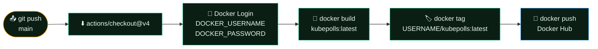
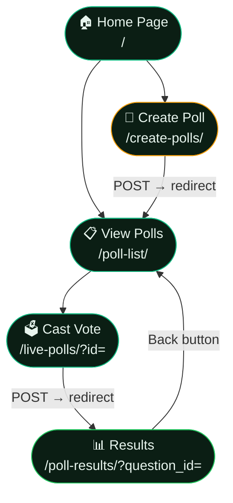
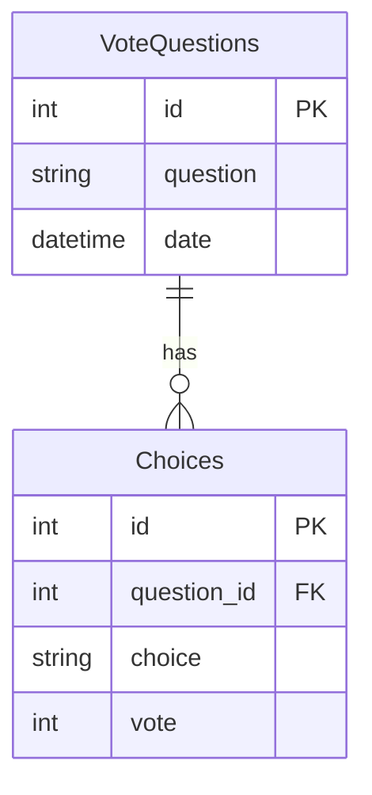
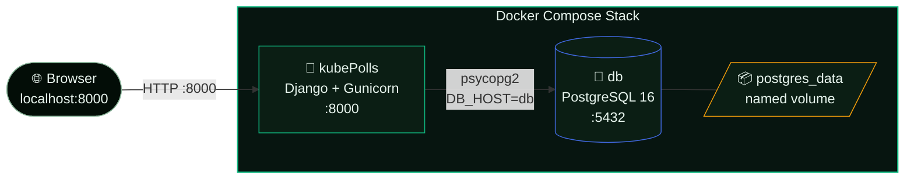
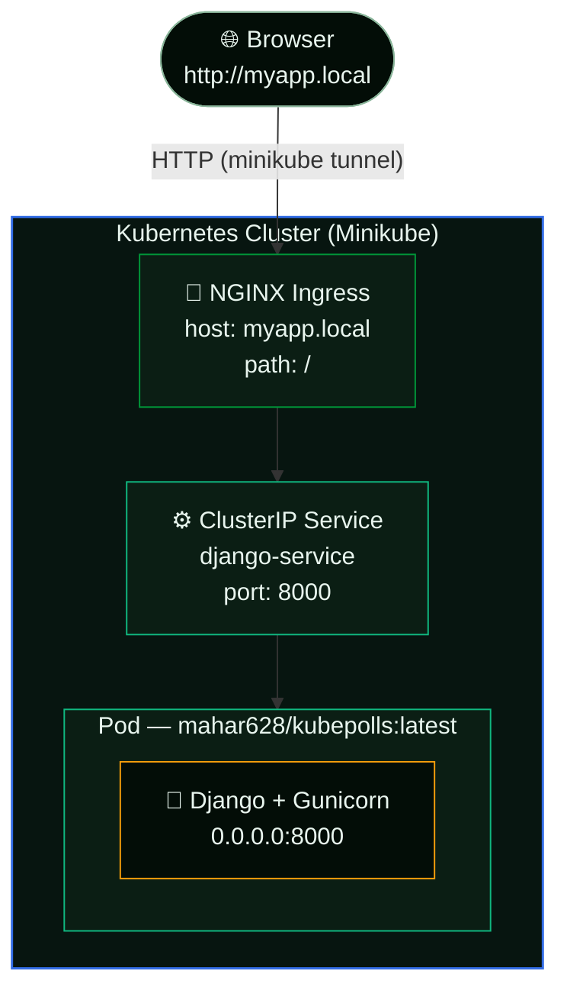
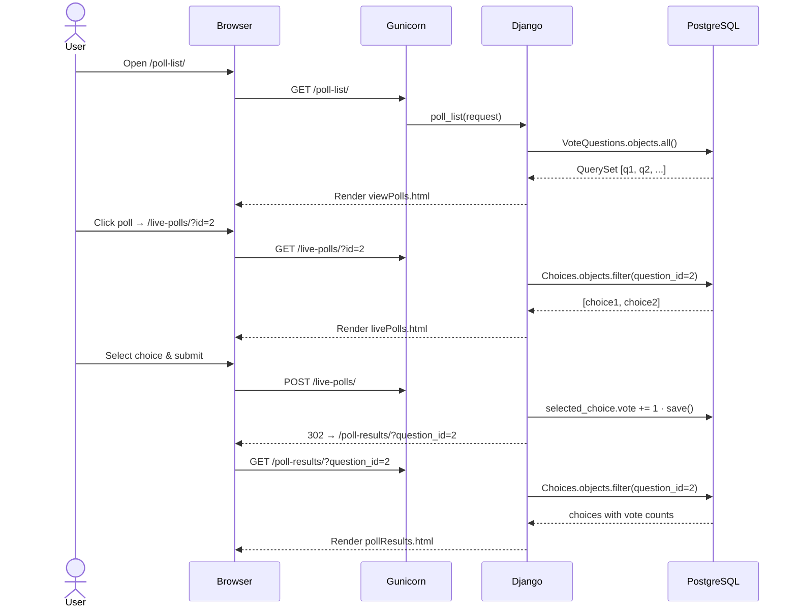

<div align="center">

```
██╗  ██╗██╗   ██╗██████╗ ███████╗██████╗  ██████╗ ██╗     ██╗     ███████╗
██║ ██╔╝██║   ██║██╔══██╗██╔════╝██╔══██╗██╔═══██╗██║     ██║     ██╔════╝
█████╔╝ ██║   ██║██████╔╝█████╗  ██████╔╝██║   ██║██║     ██║     ███████╗
██╔═██╗ ██║   ██║██╔══██╗██╔══╝  ██╔═══╝ ██║   ██║██║     ██║     ╚════██║
██║  ██╗╚██████╔╝██████╔╝███████╗██║     ╚██████╔╝███████╗███████╗███████║
╚═╝  ╚═╝ ╚═════╝ ╚═════╝ ╚══════╝╚═╝      ╚═════╝ ╚══════╝╚══════╝╚══════╝
```

### Real-time polling — cloud-native, containerized, production-ready

<br/>

[](https://python.org)
[](https://djangoproject.com)
[](https://postgresql.org)
[](https://docker.com)
[](https://kubernetes.io)

<br/>

[](https://gunicorn.org)
[](https://kubernetes.github.io/ingress-nginx/)
[](https://hub.docker.com/r/mahar628/kubepolls)
[](https://github.com/Maharavan/kubePolls/actions)

</div>

---

## Table of Contents

- [Overview](#overview)
- [Features](#features)
- [Tech Stack](#tech-stack)
- [CI/CD Pipeline](#cicd-pipeline)
- [User Flow](#user-flow)
- [Data Model](#data-model)
- [Architecture](#architecture)
  - [Docker Compose](#docker-compose-architecture)
  - [Kubernetes](#kubernetes-architecture)
- [Request Lifecycle](#request-lifecycle)
- [Project Structure](#project-structure)
- [Quick Start](#quick-start)
- [Kubernetes Deployment](#kubernetes-deployment)
- [Environment Variables](#environment-variables)
- [Cleanup](#cleanup)
- [Contributing](#contributing)
- [License](#license)

---

## Overview

**KubePolls** is a full-stack polling application built with **Django 5.2** and designed from the ground up for containerized environments. Create polls in seconds, gather votes in real time, and visualize results with animated percentage-fill bars — all running inside Docker or a Kubernetes cluster.

The project ships with a pre-built Docker image (`mahar628/kubepolls:latest`) and a PostgreSQL backend, so you can be up and running with a single command — no build step required for local development.

---

## Features

| | Feature | Description |
|---|---|---|
| ⚙️ | **Poll Creation** | Build polls with 2–5 custom choices via a clean form UI |
| ⚡ | **Live Voting** | Instant vote submission with client-side validation |
| 📊 | **Animated Results** | Smooth gradient fill-bars per choice with live percentages |
| 🧭 | **In-page Navigation** | Fixed back / forward / home buttons on every page |
| 🎨 | **Modern UI** | Glassmorphism dark theme — emerald & amber gradients, Inter font |
| 🐘 | **PostgreSQL Backend** | Production-grade relational database with persistent volume |
| 🐳 | **Docker Compose** | Two-service stack (app + db) with health-check orchestration |
| ☸️ | **Kubernetes Native** | ClusterIP Service + NGINX Ingress manifests included |
| 🔄 | **CI/CD** | GitHub Actions auto-builds and pushes Docker image on every push to `main` |

---

## Tech Stack

| Layer | Technology | Version |
|---|---|---|
| Language |  Python | 3.11 |
| Framework |  Django | 5.2 |
| Database |  PostgreSQL | 16 (Alpine) |
| App Server |  Gunicorn | 23.0 |
| Static Files |  WhiteNoise | 6.1 |
| Container |  Docker + Compose | latest |
| Orchestration |  Kubernetes | Minikube |
| Ingress |  NGINX Ingress | — |
| Frontend | Django Templates + Custom CSS (glassmorphism) | — |

---

## CI/CD Pipeline

Every push to `main` triggers a GitHub Actions workflow that builds and publishes the Docker image to Docker Hub automatically — no manual steps required.



**Required repository secrets:**

| Secret | Description |
|---|---|
| `DOCKER_USERNAME` | Your Docker Hub username |
| `DOCKER_PASSWORD` | Your Docker Hub password or access token |

> Set these under **Settings → Secrets and variables → Actions** in your GitHub repository.

---

## User Flow



---

## Data Model



---

## Architecture

### Docker Compose Architecture



### Kubernetes Architecture



---

## Request Lifecycle



---

## Project Structure

<details>
<summary><strong>Click to expand</strong></summary>

```
kubePolls/
├── django/
│   ├── members/                        # Core Django app
│   │   ├── migrations/                 # Database schema migrations
│   │   │   ├── 0001_initial.py
│   │   │   ├── 0002_alter_votequestions_date.py
│   │   │   └── 0003_choices.py
│   │   ├── static/
│   │   │   └── css/
│   │   │       ├── style.css           # Global theme (index, viewPolls, askPolls)
│   │   │       ├── livePoll.css        # Vote page styles
│   │   │       └── pollResult.css      # Results page styles
│   │   ├── templates/
│   │   │   ├── index.html              # Home — Create / View buttons
│   │   │   ├── askPolls.html           # Poll creation form
│   │   │   ├── viewPolls.html          # Poll list
│   │   │   ├── livePolls.html          # Voting form
│   │   │   └── pollResults.html        # Animated results bars
│   │   ├── models.py                   # VoteQuestions · Choices
│   │   ├── views.py                    # All view logic
│   │   └── urls.py                     # App URL routes
│   ├── votesystem/
│   │   ├── settings.py                 # Django settings (env-var driven DB config)
│   │   ├── urls.py                     # Root URL conf
│   │   └── wsgi.py
│   ├── manage.py
│   ├── requirements.txt                # gunicorn · whitenoise · django · psycopg2-binary
│   └── Dockerfile
├── k8s/
│   ├── django-app.yml                  # Deployment (1 replica, resource limits) + ClusterIP Service
│   └── django-ingress.yml              # NGINX Ingress — host: myapp.local
├── .github/
│   └── workflow.yml                    # CI — build & push Docker image on push to main
├── docker-compose.yml                  # App + PostgreSQL with health-check
└── README.md
```

</details>

---

## Quick Start

### Option A — Docker Compose (recommended for local dev)

```bash
# 1. Clone the repo
git clone https://github.com/Maharavan/kubePolls.git
cd kubePolls

# 2. Start the stack (app + PostgreSQL)
docker compose up --build

# 3. Open in browser
open http://localhost:8000
```

> On first start the app container waits for PostgreSQL to pass its health check, then runs `manage.py migrate` automatically before gunicorn starts.

```bash
# Stop and remove containers (data volume is preserved)
docker compose down

# Remove containers AND the database volume
docker compose down -v
```

---

## Kubernetes Deployment

### Step 1 — Start the cluster

```bash
minikube start --driver=docker
minikube addons enable ingress
```

### Step 2 — Apply manifests

```bash
kubectl apply -f k8s/django-app.yml
kubectl apply -f k8s/django-ingress.yml
```

Verify everything is running:

```bash
kubectl get pods
kubectl get svc
kubectl get ingress
```

### Step 3 — Configure local DNS

Get the Minikube IP:

```bash
minikube ip
```

Add to your hosts file:

| OS | Path |
|---|---|
| Linux / macOS | `/etc/hosts` |
| Windows | `C:\Windows\System32\drivers\etc\hosts` |

```
<minikube-ip>  myapp.local
```

### Step 4 — Open a tunnel

```bash
# Keep this terminal open — routes traffic to the Ingress controller
minikube tunnel
```

Then navigate to **http://myapp.local**.

> **WSL users:** `minikube service django-service` is a simpler alternative to tunnel + Ingress.

---

## Environment Variables

The Django settings are fully driven by environment variables (with sensible defaults that match the Compose file):

| Variable | Default | Description |
|---|---|---|
| `DB_NAME` | `kubepolls` | PostgreSQL database name |
| `DB_USER` | `kubepolls` | PostgreSQL user |
| `DB_PASSWORD` | `kubepolls` | PostgreSQL password |
| `DB_HOST` | `localhost` | Database hostname (`db` in Compose) |
| `DB_PORT` | `5432` | Database port |

---

## Cleanup

### Docker Compose

```bash
docker compose down -v   # stop containers + remove data volume
```

### Kubernetes

```bash
kubectl delete -f k8s/django-ingress.yml
kubectl delete -f k8s/django-app.yml
minikube stop
minikube delete          # optional — removes the VM entirely
```

---

## Contributing

Pull requests are welcome. For major changes, open an issue first to discuss what you'd like to change.

1. Fork the repo
2. Create a feature branch: `git checkout -b feature/your-feature`
3. Commit your changes: `git commit -m 'feat: add your feature'`
4. Push: `git push origin feature/your-feature`
5. Open a Pull Request

---

## License

This project is licensed under the **MIT License** — see the [LICENSE](LICENSE) file for details.

---

<div align="center">

Made with ☕ and Kubernetes by [Maharavan](https://github.com/Maharavan)

[](https://github.com/Maharavan/kubePolls)

</div>
